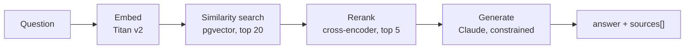
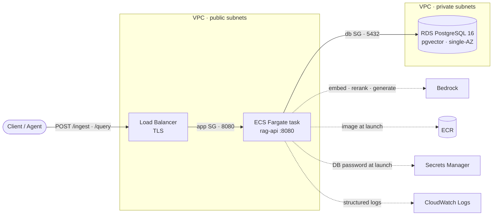

# RAG API: Two-Stage Retrieval, Cross-Encoder Reranking, Grounded Citations, Measured Recall, and LLM-as-Judge Evaluation

[](https://github.com/Go-Santiago-Go/rag-api/actions/workflows/ci.yml)
[](https://github.com/Go-Santiago-Go/rag-api/actions/workflows/deploy.yml)
[](LICENSE)

This repository is a deployed Go service that answers questions about a document corpus and cites the
passages it used, using:

- **Structure-aware chunking** on markdown headings, so a citation starts at a sentence, not mid-word
- **The same Titan v2 model embeds documents and questions**, since vectors from different models are
  not comparable
- **Two-stage retrieval**: cosine similarity over pgvector shortlists 20, a cross-encoder reorders and
  keeps 5
- **Generation constrained to the retrieved passages**, so an unanswerable question gets a refusal
  rather than an invention
- **`{ answer, sources[] }` as the contract**, where the passages that built the prompt are the
  passages returned
- **Recall@k over a pinned corpus and hand-labelled questions**, run before a retrieval change is
  adopted or rejected
- **An LLM-as-judge harness** grading faithfulness and correctness, itself validated against
  deliberately broken answers
- **AWS Bedrock** for embeddings, reranking, and generation, with **pgvector on Postgres** as the store
- **Terraform** for the infrastructure, **GitHub Actions** over OIDC for CI/CD, **ECS Express Mode on
  Fargate** for the compute

Those concerns meet on a single query:

> A caller asks a question → the service embeds it with the same model that embedded the corpus →
> pgvector returns the 20 nearest chunks → a cross-encoder reorders them and keeps the best 5 → Claude
> writes an answer constrained to those 5 → the same 5 come back as `sources[]`, so the answer can be
> checked against exactly what produced it.

## Contents

| | |
|---|---|
| [Demo](#demo) | The browser demo answering a question and showing the passages it was built from |
| [The problem](#the-problem) | What retrieval fixes about an LLM, and the new failure mode it introduces |
| [How it works](#how-it-works) | The two retrieval stages, the five interfaces every dependency sits behind, and the endpoints |
| [Quickstart](#quickstart) | Clone to a grounded answer on your laptop |
| [Trade-offs](#trade-offs) | Every design decision, what it was chosen over, and why |
| [Results](#results) | Recall@k, answer quality, and the changes the harness ruled out |
| [What I'd do differently](#what-id-do-differently) | Four things a second pass would change |
| [Known gaps and next steps](#known-gaps-and-next-steps) | Deliberately out of scope, named rather than hidden |
| [Repo layout](#repo-layout) · [Documentation](#documentation) | Where each package lives, and the six deep-dive docs |

## Demo


Recorded unedited against live Bedrock and a real pgvector instance, so the source count and the
latency are that run's own. The 2447 ms is measured in the browser around the whole `POST /query` round
trip, and nearly all of it is three sequential Bedrock calls: embedding the question, reranking 20
candidates, then generating the answer against the surviving 5. Nothing was tightened for the
recording, though the question is one of the page's four samples, all of them drawn from
[`eval/golden.json`](eval/golden.json), picked because another sample makes the model hedge, which is
correct behavior and a weak demo. The cards revealed by the scroll are the `sources[]` array from that
same response rather than a second lookup: `GET /` calls `POST /query` like any other client, so it
cannot show anything the API does not return. Watch the first card as it lands, since it holds the
sentence the answer paraphrases, which is the point of returning `sources[]` at all.

## The problem

An LLM asked about a document corpus it was never trained on will answer anyway, fluently and wrongly,
and nothing in the response distinguishes that from a correct answer. Retrieval fixes the grounding by
putting real passages in the prompt. It also introduces a second problem in the same move: you now
have a retrieval system, and retrieval quality is invisible. A pipeline that returns the wrong passages
still returns a confident, well-written answer.

What this service has to get right, and what each requirement costs if you get it wrong:

- **Ground the answer or decline.** The model is constrained to the retrieved passages, so a corpus
  that cannot answer the question produces a refusal rather than an invention. Measured: across the 8
  questions where retrieval failed outright, faithfulness stayed at 2.00.
- **Return what produced the answer, not a summary of it.** The passages that build the prompt are the
  same slice returned as `sources[]`, so a caller can verify an answer against exactly its inputs.
- **Retrieval changes are measured, not argued.** Chunk size, chunking strategy, and reranking all
  sound plausible in either direction. Without a labelled set you cannot tell which of them helped,
  and intuition here is reliably wrong: the largest single gain came from changing a constant.
- **A grader needs its own control.** An automated judge that scores everything highly is
  indistinguishable from a service that answers everything well, so the judge grades deliberately
  broken answers first and must separate them.
- **Dependency inversion at the boundary.** RAG logic depends on a `VectorStore` interface and on
  embedder and generator interfaces, never on pgvector or Bedrock, so the whole pipeline unit tests
  with no database and no cloud access.
- **The service stays plain.** No agent framework, no orchestration layer. A separate Strands agent
  consumes `/query` as a tool, and the structured `sources[]` response is what keeps that boundary
  clean.

## How it works



The same five passages that build the prompt are the five returned as `sources[]`.

Four ideas carry the design, each covered in depth in [docs/ARCHITECTURE.md](docs/ARCHITECTURE.md):

**Retrieval runs in two stages because the two fail differently.** Similarity search scans the whole
corpus but ranks coarsely, since `BedrockEmbedder` encodes each chunk without knowing what will ever be
asked of it. A cross-encoder reads question and passage together and judges far better, but nothing can
be precomputed, so it only affords a shortlist. Cheap narrows the corpus to 20, expensive orders the
best 5. Both sides of the comparison run through the same Titan v2 model, because vectors from
different models are not comparable and the failure is silent: retrieval keeps returning its nearest
neighbors, they are just the wrong ones.

**Five interfaces, and the query path depends on nothing else.** `service.Embedder`,
`service.Reranker`, `service.Generator`, `service.Chunker`, and `store.VectorStore` are the seams.
`BedrockEmbedder`, `BedrockGenerator`, and `BedrockReranker` implement the first three and
`store.Postgres` implements the last, but `internal/service/query.go` imports none of them: its entire
import block is `context`, `fmt`, `strings`, and `internal/store`, and `cmd/server/main.go` is the only
file that wires a concrete dependency in. The payoff is `internal/service/query_test.go`, which
substitutes `fakeEmbedder`, `fakeStore`, `fakeReranker`, and `fakeGenerator` for all four dependencies
of the query path, so `go test ./...` exercises the whole pipeline with no database, no AWS
credentials, and no network.

**The grounding set and the citation set are one slice.** Not a re-query, not a reconstruction. That
identity is enforced in `internal/service/query.go` rather than by convention, which is what makes an
answer auditable instead of merely plausible.

**Chunking is an interface, not a function.** Chunking strategy is the biggest lever on retrieval
quality, so `FixedChunker` and `StructuredChunker` are two implementations of `service.Chunker` rather
than a flag inside one. That is what let them be measured against each other without either being
disturbed, and the measurement is what settled which ships.

| Endpoint | Purpose |
|---|---|
| `POST /ingest` | Chunks the text, embeds each chunk, stores the vectors. Synchronous, `201` once stored. |
| `POST /query` | Embeds, retrieves 20, reranks to 5, generates a constrained answer. Returns `{ answer, sources[] }`. |
| `GET /` | The embedded browser demo of the query path. |
| `GET /health` | Liveness only. Touches neither Bedrock nor the database. |

Full reference, status codes, and what `sources[]` guarantees: [docs/API.md](docs/API.md).

Deployed, that pipeline is one Fargate task sitting between a load balancer and Postgres:



Solid edges are the request path; dashed are the task's own outbound calls. The two labelled hops are
the interesting part. A **security group** is an allowlist attached to one hop: it names who may open a
connection, and everything unnamed is refused. Both here are deliberately narrow, so nothing reaches
the task except the load balancer, and nothing reaches Postgres except the task.

That is what makes the placement defensible. Express Mode manages the load balancer and the tasks as a
single unit and gives them one shared subnet set, so it is the service, not a design choice here, that
puts the tasks in public subnets whenever the URL is public. They hold public IPs as a result and still
cannot be reached from the internet, since no rule admits anything but the load balancer. Postgres is
further out of reach again: its route table has no path to the internet at all, so isolation there is
routing rather than a rule that could be edited. The walkthrough, both Terraform stacks, and
the three constraints Express Mode imposes are in [docs/DEPLOYMENT.md](docs/DEPLOYMENT.md).

## Quickstart

Local first. Prerequisites: [Go 1.26+](https://go.dev/doc/install),
[Docker](https://docs.docker.com/get-docker/), and AWS credentials with
[Bedrock model access](https://docs.aws.amazon.com/bedrock/latest/userguide/model-access.html) granted
for Titan Text Embeddings V2, Cohere Rerank v3.5, and a Claude model. Bedrock is opt in per account,
so even the local run is not fully offline.

```bash
git clone https://github.com/Go-Santiago-Go/rag-api.git && cd rag-api

make up      # Postgres + pgvector; schema auto-applies on first boot
make run     # the service on :8080
```

```bash
curl -X POST localhost:8080/ingest -H 'Content-Type: application/json' \
  -d '{"document_id":"doc-1","text":"pgvector stores embeddings inside Postgres."}'

curl -s -X POST localhost:8080/query -H 'Content-Type: application/json' \
  -d '{"question":"Where does pgvector store embeddings?"}'
# { "answer": "...", "sources": [ { "content": "...", "document_id": "doc-1" } ] }
```

Then open <http://localhost:8080> for the browser demo. `make help` lists the rest: `test`, `lint`, the
`eval-*` harness targets, and the cloud stack. Full setup and the environment variable reference are in
[docs/LOCAL_DEV.md](docs/LOCAL_DEV.md); standing it up on AWS is
[docs/DEPLOYMENT.md](docs/DEPLOYMENT.md).

## Trade-offs

I optimized every choice below for one constraint: the simplest component that satisfies the
requirement, reaching for managed or heavyweight infrastructure only where the workload genuinely
demands it. The decisions that are not load-bearing sit behind interfaces, so they can change later
without disturbing the core.

| Decision | Choice | Why | Also considered |
|---|---|---|---|
| Vector storage | pgvector on Postgres | One datastore, standard SQL, free and reproducible locally, swappable behind an interface | OpenSearch Serverless, S3 Vectors |
| Vector store access | Behind a `VectorStore` interface | The service unit tests against a fake with no database, and the store swaps without touching RAG logic | Call pgx directly from the service |
| API style | REST over JSON | Consumers are a human, a browser, and one agent tool; no streaming requirement yet | gRPC |
| Service shape | Single Go service | Smallest thing that ships; no premature split of ingestion into its own service | Separate Python ingestion service |
| Query response | `{ answer, sources[] }` | Structured citations make the demo verifiable and give a downstream agent clean data instead of prose to parse | Prose-only answers |
| Citation provenance | The prompt slice *is* the response slice | A re-query could return passages the answer was not built from, which is a citation that cannot be trusted | Re-retrieve for display |
| Relevance scores | Ordered, but not returned | A cross-encoder score is uncalibrated; exposing it invites a consumer to threshold on it as confidence | Return the score per source |
| Retrieval | Dense search plus cross-encoder rerank | Measured: moved the answering passage into first place for 7 more questions out of 35, and reached dense retrieval's recall@5 using 3 chunks instead of 5 | Hybrid BM25 with RRF, dense only |
| Chunking | Structure-aware on markdown headings, 800 runes | Chunks are returned verbatim as citations, and fixed-size splitting left most of them starting mid-sentence; recall is at parity at the same ceiling | Fixed-size, semantic (embedding-distance) chunking |
| Chunking shape | A `Chunker` interface, not a function | Chunking is the biggest lever on retrieval quality, so strategies must be comparable without editing the ingest path | One function with a strategy flag |
| Text extraction | Local extraction | Free and offline; reach for a managed service only if the workload needs it | AWS Textract |
| Schema management | Embedded SQL, applied idempotently at boot | Cloud RDS has no init hook and the distroless image has no `psql`, so the binary has to own it | A migration tool, an init container |
| Compute | ECS Express Mode on Fargate | Managed networking, load balancing, and scaling from a container image; App Runner is closed to new customers | Full ECS Fargate |
| Terraform layout | Two stacks split by lifetime | The billable half is destroyed nightly while the free half (ECR, the CI role) survives, so teardown never costs a re-bootstrap | One stack |
| CI credentials | GitHub OIDC, no stored keys | Nothing long-lived to leak or rotate, and the trust policy pins immutable numeric IDs so a repo rename cannot break CD | An IAM user with access keys in secrets |
| Evaluation | Recall@k on hand-labelled passages | The only way to tell an improvement from a plausible story; two changes adopted, two rejected, one finding retracted | Ship on intuition, vibe-check answers |
| Judge trust | Validated against broken answers first | A grader that scores everything highly looks exactly like a service that answers everything well | Quote the judge's raw score |

The pattern under all of it is **dependency inversion at the boundaries**: the RAG logic depends on
interfaces, and the concrete pgvector and Bedrock implementations plug in at `main`. That is what lets
the pipeline be tested with a fake store and no cloud, and it is why a second chunking strategy and a
reranking stage could be added as new implementations rather than as edits scattered through the ingest
and query paths.

Go with no framework (`net/http` 1.22 routing, `log/slog`), Postgres and pgvector for storage, AWS
Bedrock for embeddings, reranking, and generation, a plain `//go:embed` HTML page for the browser demo,
and Docker, Terraform, and GitHub Actions to build, provision, and ship it.

## Results

| | Measured |
|---|---|
| Passage recall@5 | **57.1% → 77.1%**, across four changes each measured before adoption |
| Answer faithfulness | **2.00 / 2.00**, zero unfaithful answers across 70 graded responses |
| Answer correctness, split by retrieval | **1.89** when the passage was retrieved, **0.25** when it was not |
| Changes the harness rejected | **2 adopted, 2 rejected, 1 finding retracted** |

Measured against [`eval/`](eval/): a pinned 45 document corpus and 35 questions hand-labelled with the
passage that answers each. The corpus is loaded through the real `POST /ingest` endpoint, so it is
chunked and embedded by exactly the code path a user hits. Reproduce with `make eval-recall` and
`make eval-judge` ([how](docs/LOCAL_DEV.md#running-the-evaluation-harness)).

Passage-level recall@5 on the harder of the two question phrasings, 35 questions:

| configuration | recall@5 |
|---|---|
| fixed-size chunking, dense retrieval (starting point) | 57.1% |
| \+ cross-encoder reranking | 62.9% |
| \+ 800-rune chunks | 74.3% |
| \+ structure-aware chunking (current default) | **77.1%** |

The harness was as useful for what it ruled *out*:

- **Document-level labels, discarded.** 97.1% against a 100% ceiling meant the entire dynamic range was
  one question. A metric that cannot fail cannot inform.
- **Hybrid BM25, deprioritized.** Lexical matching only helps when the query carries the answer's rare
  token, which is the case dense retrieval already handles near-saturated.
- **A finding, retracted.** Identifier questions appeared to outscore conceptual ones until a control
  showed the questions had been written containing their own answers' distinctive tokens.
- **Chunk size beat chunking strategy.** The largest single gain, +11.4 points, came from changing a
  constant. Structure-aware splitting cut severed boundaries from 66% to 4.8% at the same 800-rune
  ceiling and moved recall barely at all. It is still the default, because chunks are returned verbatim
  as `sources[]` and a citation beginning mid-word is a defect the harness cannot see.

At 35 questions one question is worth 2.9 points, so small deltas are noise and are treated as such.

### Answer quality

Recall proves the right passage came back, not what the model did with it. A second harness runs the
real query pipeline and grades each answer with a stronger model on **faithfulness** (is every claim
supported by the sources given) and **correctness** (does it state the labelled fact), split by whether
retrieval actually found the answering passage:

| phrasing | segment | n | faithfulness | correctness |
|---|---|---|---|---|
| paraphrased | retrieved | 27 | 2.00 | 1.89 |
| paraphrased | not retrieved | 8 | 2.00 | 0.25 |
| paraphrased | **overall** | 35 | **2.00** | **1.51** |

**Zero unfaithful answers across 70 gradings**, including all 8 questions where retrieval failed
outright: handed nothing useful, the model declined instead of inventing an answer.

A perfect faithfulness score is normally the saturation alarm, so the judge is validated first. It
grades deliberately broken answers and must separate them: swapping in another question's sources drops
faithfulness to 0.20 while correctness holds at 2.00, and appending one invented flag drops it to 1.00.
The check exits non-zero if that separation fails, which is what makes the ceiling readable as a result
rather than a broken ruler.

Verified end to end, not just locally: the service has served grounded answers from ECS Express Mode on
Fargate against RDS, provisioned by the Terraform in this repo, with GitHub Actions pushing images to
ECR over OIDC. **There is no permanent public URL.** The billable stack is destroyed with
`make destroy` after each session to keep the cost at pennies, so the URL is regenerated per deploy
rather than kept always-on, and standing it up again is
[docs/DEPLOYMENT.md](docs/DEPLOYMENT.md). Full results, controls, and caveats in
[`eval/README.md`](eval/README.md).

## What I'd do differently

Four things I would change on a second pass, separate from the scoping calls below. These are
hindsight, not parked work.

**Write the labelled questions without the answer's tokens in them.** The first question set was
written by reading a passage and asking about it, which quietly copied the passage's distinctive
identifiers into the query. That made retrieval look better than it was and produced a finding I had to
retract. The fix was a second, paraphrased phrasing of every question, and paraphrased is now the only
number quoted. Writing them that way the first time costs nothing; discovering it afterwards
invalidates every measurement taken before the control existed.

**Sweep the cheap constants before building the expensive change.** Structure-aware chunking was the
elaborate piece of work and moved recall barely at all. Changing the chunk size from 500 to 800 runes
was a one-line diff and was worth +11.4 points, the largest single gain in the project. The ordering
should have been the reverse: sweep chunk size, overlap, and top-k first, then reach for a new strategy
only if the parameter surface is exhausted. Structure-aware chunking still earned its place, but on a
citation-quality argument rather than the recall argument I was expecting.

**Build the judge's validation step at the same time as the judge.** Validation exists here because a
faithfulness score of 2.00 looked too clean to believe, which means the check was motivated by
suspicion of a specific result rather than designed in. That is the wrong order: a grader you only
validate when you dislike its answer is a grader you have already stopped trusting. Broken-answer
controls should ship with the first version, before any real score is read.

**Weigh Express Mode against full ECS Fargate knowing teardown is not clean.** Express Mode creates and
owns its load balancer, so `terraform destroy` cannot remove it and every teardown leaves an orphaned
ALB whose ENIs block the internet gateway, and therefore the whole VPC, from deleting. It bought real
simplicity in the service definition and I would still probably choose it, but I would choose it with
that cost priced in rather than discovered at 2am on a stack I was trying to stop paying for.

## Known gaps and next steps

Deliberately out of scope, named rather than hidden. Each has a real answer I would reach for if the
workload demanded it.

**`/ingest` is synchronous and embeds one chunk at a time.** Wall-clock time grows linearly with
document length, and a large upload holds a request open for the whole run. The answer is batching the
Bedrock calls first, then moving ingestion behind a queue with a job ID to poll. Neither is needed to
load a 45 document corpus, which is what this actually does.

**No authentication on any endpoint.** Acceptable for a demo torn down after each session, not
otherwise. The gateway pattern for this is a sibling project rather than something to reinvent here.

**Tasks run in public subnets.** Forced by Express Mode's single subnet set. They are unreachable
except through the load balancer, since the app security group has no inbound rule of its own, but the
private app subnets sit empty and the NAT gateway bills while carrying no packets. A hand-rolled
`aws_ecs_service` is the escape hatch, at the cost of writing the load balancer, target group, and
listener by hand.

**RDS is single-AZ and there are no VPC endpoints.** Both are cost choices for a stack destroyed
nightly, and both are the first things to change for anything real. Multi-AZ doubles the instance cost;
VPC endpoints would take Bedrock and ECR traffic off the NAT gateway.

**An S3 bucket is provisioned but unused.** `infra/s3.tf` and its task-role grant exist so raw file
upload can be added without another infra change. Nothing writes to it today.

**The evaluation set is small and single-domain.** 35 questions over 45 technical documents: enough to
rank configurations against each other, not enough to claim a general result. A second corpus from a
different domain is the honest next step, and it would probably move the absolute numbers.

**Retrieval failures dominate the remaining error.** Correctness is 1.89 when the right passage is
retrieved and 0.25 when it is not, so the next real gain is in retrieval, not prompting. Query
rewriting and multi-query retrieval are the candidates; better prompts are not.

## Repo layout

| Path | Contents |
|---|---|
| `cmd/server/` | Entrypoint and composition root. Builds every concrete dependency and injects it down through interfaces. The only package naming pgvector or Bedrock. |
| `internal/handler/` | HTTP: parse the request, call the service, write the response. Thin by design. Holds `index.html`, the browser demo embedded with `//go:embed`. |
| `internal/service/` | The RAG logic. `chunk.go` holds two `Chunker` strategies; `query.go` holds the two-stage retrieval path and the slice that is both the prompt and the citations. |
| `internal/store/` | The `VectorStore` interface and its pgvector implementation, the only place that knows SQL. `schema.sql` is embedded and applied idempotently at boot, since RDS has no init hook. |
| `eval/` | Measurement. `golden.json` is 35 questions with two phrasings each; `cmd/` holds load (ingest), run (recall@k), and judge (answer quality). |
| `infra/` | Terraform for the billable app stack: VPC, RDS, S3, the ECS Express service. Destroyed after each session. |
| `infra/bootstrap/` | Terraform for the free persistent stack: the ECR repository and the GitHub OIDC CI role. Applied first, stays up. |
| `migrations/` | The same schema again, for the docker-compose init hook that the cloud path does not have. |
| `docs/` | Architecture, API reference, local development, deployment, operations, conventions. |

Reading with limited time, the files that carry the interesting work are
[`internal/store/store.go`](internal/store/store.go) (the interface the whole
dependency-inversion argument rests on), [`internal/service/query.go`](internal/service/query.go) (two
stage retrieval, and the single slice that is both prompt and `sources[]`), and
[`eval/README.md`](eval/README.md) (the measurement record, including what it rejected and the finding
it forced me to retract).

## Documentation

| Doc | What is in it |
|---|---|
| [docs/ARCHITECTURE.md](docs/ARCHITECTURE.md) | The AWS topology, the two Terraform stacks, the request path end to end, the interface boundaries, and how evaluation plugs in |
| [docs/API.md](docs/API.md) | Endpoint reference, status codes, chunking behavior at ingest, and what `sources[]` guarantees |
| [docs/LOCAL_DEV.md](docs/LOCAL_DEV.md) | Running it locally, every environment variable, the development commands, and the evaluation harness |
| [docs/DEPLOYMENT.md](docs/DEPLOYMENT.md) | What gets provisioned on AWS, both Terraform stacks, a step by step deploy, and teardown |
| [docs/OPERATIONS.md](docs/OPERATIONS.md) | Cost, the failure modes and the command that diagnoses each, the teardown gotchas, and verifying a deploy |
| [docs/CONVENTIONS.md](docs/CONVENTIONS.md) | How the docs are structured, and the accuracy guards every claim in them has to survive |
| [eval/README.md](eval/README.md) | The measurement record: results, controls, rejected changes, and caveats |

## License

MIT. See [LICENSE](LICENSE).
