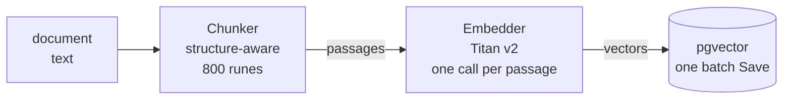
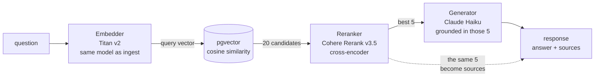
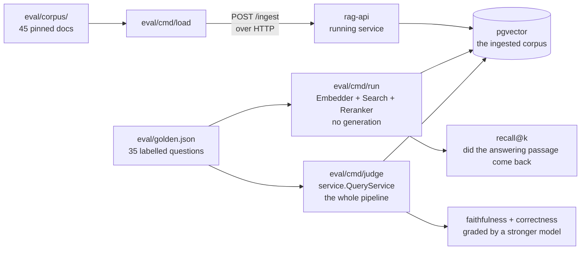

# Architecture

How `rag-api` is put together: the two request paths through the service, the four ideas that carry
the design, the code boundaries that make any of it testable, and how the evaluation harness attaches
to prove it works. The README carries a one-paragraph summary of each; this is the long version.

Where it *runs* is a separate concern, and lives in [DEPLOYMENT.md](DEPLOYMENT.md): the AWS topology
diagram, the two Terraform stacks split by lifetime, and the three constraints Express Mode imposes.

## The two request paths

**`POST /ingest`** makes a document searchable:



**`POST /query`** answers a question against what was ingested:



Two details the pipelines above are worth reading for.

**Ingest embeds one passage at a time** (`internal/service/ingest.go:37-47`), then writes every chunk
in a single `Save`. The embed loop is sequential, so ingest time scales with document length and is
the slowest thing the service does. Batching it is the obvious optimization and has not been needed
yet at this corpus size.

**The reranked 5 are the answer's sources.** The same `[]store.Match` that builds the grounding
prompt is returned as `sources[]` (`internal/service/query.go:88-93`), which is why a citation cannot
drift from what the model actually saw. The dashed edge in the diagram is that identity, not a second
computation.

## Retrieval runs in two stages because the two fail differently

Similarity search is fast enough to scan the whole corpus but encodes each chunk without knowing what
will ever be asked of it, so its ranking is coarse. A cross-encoder reads the question and a passage
together and judges that specific pair far better, but nothing about it can be precomputed, so it can
only afford to look at a shortlist. Cheap and approximate narrows the field; expensive and accurate
orders what survives.

The gain is measured rather than assumed: reranking moved the answering passage into first place for 7
more questions out of 35, and reached dense retrieval's recall@5 using 3 chunks instead of 5. See
[`eval/README.md`](../eval/README.md).

Both sides of the comparison must run through the same embedding model. Vectors from different models
are not comparable, so mixing them degrades retrieval silently rather than failing loudly, and the
pgvector column dimension is pinned to match (`vector(1024)` for Titan v2).

## Five interfaces, and the query path depends on nothing else

The pattern under all of it is **dependency inversion at the boundaries**. `service.Embedder`,
`service.Reranker`, `service.Generator`, `service.Chunker`, and `store.VectorStore` are the seams.
`BedrockEmbedder`, `BedrockGenerator`, and `BedrockReranker` implement the first three, `store.Postgres`
implements the last, and `cmd/server/main.go` is the only file that wires a concrete one in.

```
cmd/server/main.go     entrypoint: wires the concrete implementations, starts the server. Thin.
internal/handler/      parse the request, call the service, write the response. No logic.
internal/service/      the RAG pipeline: chunk, embed, search, rerank, generate.
internal/store/        the VectorStore interface and its pgvector implementation. The only SQL.
```

`internal/service/query.go` imports none of the concrete types. Its entire import block is `context`,
`fmt`, `strings`, and `internal/store`. That is what lets `internal/service/query_test.go` substitute
`fakeEmbedder`, `fakeStore`, `fakeReranker`, and `fakeGenerator` for all four dependencies of the query
path, so `go test ./...` exercises the whole pipeline with no database, no AWS credentials, and no
network.

Two things follow. The test suite needs no cloud access and no container, which is why CI runs it on
every push without secrets. And pgvector can be swapped for another vector store without touching the
RAG logic, which makes that choice reversible rather than load bearing.

Handlers orchestrate and services do the work. Handlers parse HTTP and choose status codes; all
business logic lives in `internal/service` so it stays testable without a server.

## The grounding set and the citation set are one slice

The same `[]store.Match` that builds the grounding prompt is returned as `sources[]`
(`internal/service/query.go:88-93`). Not a re-query, not a reconstruction, not a second retrieval pass.
The dashed edge in the query diagram above is that identity rather than a computation.

This is what makes an answer auditable instead of merely plausible: a citation cannot drift from what
the model actually saw, because there is no second thing for it to drift from. It is also the contract
that keeps this service free of agent concerns, since a downstream agent gets structured data to reason
over instead of prose it would have to parse.

## Chunking is an interface, not a function

Chunking strategy is the biggest lever on retrieval quality and the one most worth experimenting with,
so `FixedChunker` and `StructuredChunker` are two implementations of `service.Chunker` rather than a
flag inside one function. A new strategy is a new implementation rather than an edit to the ingest
pipeline, and two strategies can be compared without either one being disturbed.

That is not a hypothetical benefit. It is what let structure-aware chunking be measured against
fixed-size chunking at the same 800-rune ceiling, which is how the severed-boundary result (66% down to
4.8%) was separated from the recall result (barely moved) rather than confounded with it.

## How evaluation plugs in

The clearest evidence those boundaries pay off is that the evaluation harness attaches at three
different depths, each chosen to isolate what it measures:



**Load goes over HTTP.** `eval/cmd/load` posts each document through the real `POST /ingest`
(`eval/cmd/load/main.go:3`), so the corpus is chunked and embedded by exactly the code path a user
would hit. Measuring a pipeline you loaded by a private side door measures the side door.

**Recall goes below the service.** `eval/cmd/run` calls `store.Search` directly and never touches
`/query` (`eval/cmd/run/main.go:4-8`). Generation cannot change which chunks came back, so including
it would put a nondeterministic, billed component inside a measurement it provably cannot influence.
Nothing is faked: this is the real Bedrock embedder against the real pgvector index.

**Answer quality goes through the service.** `eval/cmd/judge` constructs a real `service.QueryService`
from the same constructor `main` uses (`eval/cmd/judge/main.go:366-372`) and calls `Query`, then hands
each answer to a different, stronger Bedrock model for grading. It runs the whole pipeline in-process
rather than over HTTP, which is possible only because the service depends on interfaces rather than on
a running server.

That spread is the dependency inversion paying rent. Swapping the depth of measurement needed no
change to `internal/service` at all.
