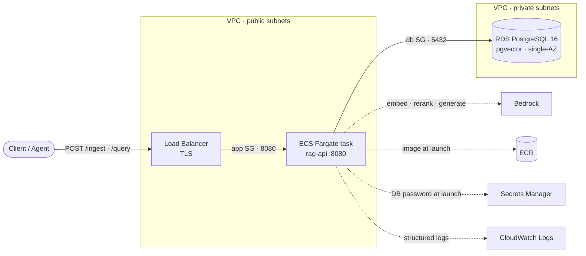

# Deploying rag-api to AWS

This walks through cloning the repo and standing up the whole service on AWS: a containerized Go RAG
service on ECS Express Mode, pgvector in RDS as the vector store, and Amazon Bedrock for embeddings,
reranking, and generation, all provisioned with Terraform. At the end you get a public
`*.ecs.<region>.on.aws` URL that answers questions with grounded citations.

Two warnings before you start. First, this creates **billable** resources, mainly the RDS instance,
the NAT gateway, and the Express Mode load balancer. It is a few cents to about a dollar for a short
session, but you must tear it down when done. Second, the local path (see
[LOCAL_DEV.md](LOCAL_DEV.md)) is free and proves the same request path, so deploy to AWS only when you
actually want the cloud demo.

## What gets provisioned

I run the container on **Amazon ECS Express Mode on Fargate**: from an image plus three IAM roles,
Express Mode provisions the Fargate service, an internet-facing load balancer with TLS, autoscaling,
health checks, and the security-group wiring between the load balancer and the task, and hands back
the public URL. Unlike a stateless gateway, this service has a data tier: **RDS PostgreSQL 16 with the
pgvector extension** holds the chunks and their embeddings, and it has no public endpoint, accepting
connections only from the app's security group.

Bedrock is reached over the internet gateway rather than a private endpoint, so the tasks make
outbound calls to three models: Titan v2 to embed, Cohere Rerank v3.5 to reorder, and Claude to
generate. The RDS master password never enters the image or Terraform state; RDS owns it through
`manage_master_user_password`, and ECS injects it from Secrets Manager at task launch.



The two solid paths are what a request does: **in** through the load balancer to the ECS task, then
**out** to Postgres for the vector search. The dashed lines are the task's own outbound calls, and the
task is the client on every one of them. They leave through the internet gateway rather than a private
endpoint, because each task's ENI holds a public IP and the public route table's default route is the
IGW (`infra/network.tf:140`).

**Security groups are named on the edges they permit**, which is the honest place for them: a security
group *is* a rule about one hop, and `app SG` admits nothing to the task except the load balancer on
8080, while `db SG` admits nothing to Postgres except the task on 5432. Drawing them as bands around
the resources they protect is the conventional picture and is not possible here, since mermaid
subgraphs cannot overlap, but the edge label carries the same claim without the boxes.

Those two rules are what make running tasks in public subnets defensible. The tasks hold public IPs and
are still unreachable from the internet, because nothing but the load balancer is admitted.

The diagram is **as deployed**, not as idealized, and it draws only what carries traffic. It leaves out
the second Availability Zone, since it holds no instance, along with the empty private app subnets and
the idle NAT gateway, both covered below.

What survives the public-subnet trade-off intact is the data tier. The data route table has **no
default route at all** (`infra/network.tf:184`), only the implicit local route, so RDS has no path to
or from the internet regardless of what any security group says. Routing is the real isolation and the
security group is a second layer on top.

A multi-stage Docker build ships a distroless binary for a small image and attack surface, and GitHub
Actions builds and pushes it to ECR over GitHub OIDC with no stored AWS credentials: the trust policy
matches the token's `sub` claim, which carries immutable numeric IDs for the org and repo, so renaming
either cannot break deploys.

The `infra/` directory holds two Terraform stacks, split by lifetime:

- **`infra/bootstrap/`** provisions the free, long-lived pieces: the ECR repository and the GitHub
  OIDC CI role. Apply it once and leave it up, so CI can push images at any time and images survive
  the app stack's teardown.
- **`infra/`** provisions the billable app stack: the VPC and its subnets, RDS with pgvector, the S3
  bucket and its task-role grant, and the ECS Express service with its task and execution roles. It
  looks the ECR repository up by name, so bootstrap must be applied first. This is the stack you
  destroy after each session.

The meters while up are the RDS instance, the NAT gateway, and the Express Mode load balancer. There
is no scale-to-zero, so a `destroy` after each session is what keeps the bill at pennies.

### Three constraints worth knowing up front

First, **Express Mode places the tasks in public subnets** (`infra/ecs.tf:110`). It uses a single
subnet set for both the load balancer and the tasks, so you cannot keep the tasks in a private app
tier while the load balancer stays public. They hold public IPs but stay unreachable, because the app
security group has no inbound rule except the one Express adds for the load balancer. Two things
follow, and the diagram omits both because a diagram of the request path should not draw what no
request touches: **the private app subnets are empty**, and **the NAT gateway is idle**, since it is
the default route only for the app route table (`infra/network.tf:165`) which is associated only with
those empty subnets. It bills by the hour and carries no packets. A hand-rolled `aws_ecs_service` is
the escape hatch if fully private tasks ever become a requirement.

Second, **RDS is single-AZ, and the second private subnet is a membership requirement rather than a
standby.** A DB subnet group must span two Availability Zones even when only one instance exists, so
the task in Zone B crosses a zone boundary to reach the database. That is the availability trade-off
the single-AZ choice buys, and Multi-AZ is the first thing to change for anything real.

Third, **the app migrates itself on startup.** Cloud RDS has no init hook and the distroless image
carries no `psql`, so `internal/store/schema.sql` is embedded in the binary and applied idempotently
(`IF NOT EXISTS`) every boot. Nothing external has to run before the first request, and a fresh
database needs no manual step.

## Prerequisites

- An AWS account, with the [AWS CLI](https://docs.aws.amazon.com/cli/latest/userguide/getting-started-install.html) configured (`aws configure`).
- [Terraform](https://developer.hashicorp.com/terraform/install) and [Docker](https://docs.docker.com/get-docker/).
- **Bedrock model access.** In the Bedrock console, request access to **Titan Text Embeddings V2**
  and a **Claude** model in your region. Bedrock is opt in per account, and the service fails with
  `AccessDenied` until this is granted. See [Manage model access](https://docs.aws.amazon.com/bedrock/latest/userguide/model-access.html).
- Optional but wise: a [budget alert](https://docs.aws.amazon.com/cost-management/latest/userguide/budgets-create.html)
  at a few dollars so nothing surprises you.

## Step 1: Clone

```bash
git clone https://github.com/Go-Santiago-Go/rag-api.git
cd rag-api
```

## Step 2: Apply the persistent stack (free)

The infrastructure is split into two Terraform stacks by lifetime. The **bootstrap** stack holds the
free, long lived pieces: the ECR container registry and the GitHub OIDC role CI uses to push images.
Apply it once and leave it up.

```bash
cd infra/bootstrap
terraform init
terraform apply    # creates the ECR repo and the CI role; both are free
cd ../..
```

## Step 3: Get an image into ECR

The app stack deploys an image by tag, so ECR needs one before you deploy. You have two ways.

**Option A, build and push locally.**

```bash
ACCOUNT=$(aws sts get-caller-identity --query Account --output text)
REGION=us-east-1
REPO="$ACCOUNT.dkr.ecr.$REGION.amazonaws.com/go-rag-api"

docker build -t "$REPO:latest" .
aws ecr get-login-password --region $REGION \
  | docker login --username AWS --password-stdin "$ACCOUNT.dkr.ecr.$REGION.amazonaws.com"
docker push "$REPO:latest"
```

**Option B, let CI push it.** In the GitHub repo, add a repository variable `AWS_ROLE_ARN` (Settings,
then Secrets and variables, then Actions, then Variables) set to the CI role ARN from Step 2. Then
merge to `main`, and the `deploy` workflow builds the image and pushes it to ECR with no stored AWS
keys, using OIDC.

## Step 4: Apply the app stack

This provisions the VPC, RDS Postgres with pgvector, S3, and the ECS Express Mode service, and waits
until the service is healthy. Budget about 10 to 15 minutes: RDS alone takes roughly 5, then Express
Mode waits for health checks.

```bash
cd infra
terraform init
terraform apply
terraform output service_url    # your live public URL
```

## Step 5: Test it

```bash
URL=$(terraform output -raw service_url)

# health
curl "$URL/health"        # {"status":"ok"}

# ingest a document, then ask about it
curl -X POST "$URL/ingest" -H 'Content-Type: application/json' \
  -d '{"document_id":"doc-1","text":"Acme offers a full refund within 30 days of purchase."}'

curl -s -X POST "$URL/query" -H 'Content-Type: application/json' \
  -d '{"question":"What is the refund window?"}'
# { "answer": "...30 days...", "sources": [ ... ] }
```

## Step 6: Tear it down

```bash
cd infra
terraform destroy    # removes the billable app stack (VPC, RDS, S3, ECS)
```

Leave the bootstrap stack up: ECR and the CI role are free, and keeping them means CI can push images
at any time and your pushed image survives for the next deploy. If you want everything gone,
`terraform destroy` in `infra/bootstrap` too.

`destroy` can hang on the Express Mode service or the internet gateway. That failure and its fix are
in [OPERATIONS.md](OPERATIONS.md#teardown-hangs-on-the-express-service-or-the-internet-gateway).

## Troubleshooting

- **Tasks crash loop, `AccessDenied` from Bedrock in the logs.** Model access is not granted in this
  region, or you deployed to a region without it. Bedrock is opt in per account: grant Titan Text
  Embeddings V2, Cohere Rerank v3.5, and a Claude model in the region you deployed to. First use of
  Claude is additionally gated by a one-time Anthropic use-case form.
- **Tasks crash loop trying to connect to `localhost`.** Almost never the configuration. The image in
  ECR is older than the code that reads the `PG*` vars, so it falls through to the local default.
  Rebuild and re-push before concluding anything else, and check which commit is actually running with
  `aws ecr describe-images --repository-name go-rag-api --query 'sort_by(imageDetails,&imagePushedAt)[-1].[imageTags,imagePushedAt]'`.
- **`terraform apply` in `infra/bootstrap` fails to find the OIDC provider.** This stack *reads* the
  GitHub OIDC provider with a data source rather than creating it, because it is an account-level
  singleton and destroying it would break other stacks. On an account that has never federated GitHub,
  create the provider once by hand, then re-apply.
- **CI fails at "Configure AWS credentials".** The `AWS_ROLE_ARN` repository variable is missing, or
  the trust policy's numeric org and repo IDs do not match your fork. Do not guess at the policy: read
  the `sub` claim AWS actually received, using the CloudTrail command in
  [OPERATIONS.md](OPERATIONS.md#ci-cannot-assume-its-role).
- **The URL is unreachable and `access_type` is `PRIVATE`.** The service landed in private subnets.
  Express Mode needs the public subnets for an internet-facing load balancer; `infra/ecs.tf` already
  places them correctly, so this means a local edit moved them.
- **`apply` errors that a resource already exists.** An earlier run left something behind. Reconcile
  with `terraform plan`, then import or delete the stray resource.
- **`destroy` hangs on the Express service or the internet gateway.** Express Mode orphans its load
  balancer, whose ENIs hold public IPs that block the internet gateway. Delete the orphaned
  `ecs-express-gateway-alb-*` and its `ecs-gateway-tg-*` target groups by hand, then re-run. Full
  detail in [OPERATIONS.md](OPERATIONS.md#teardown-hangs-on-the-express-service-or-the-internet-gateway).

Deploy-time failure modes are catalogued with their diagnosis commands in
[OPERATIONS.md](OPERATIONS.md).
